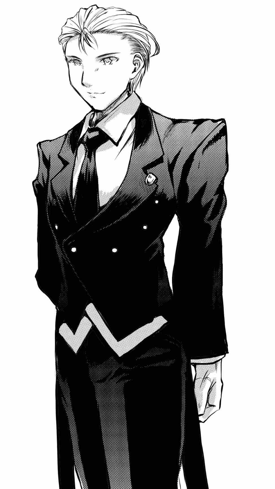
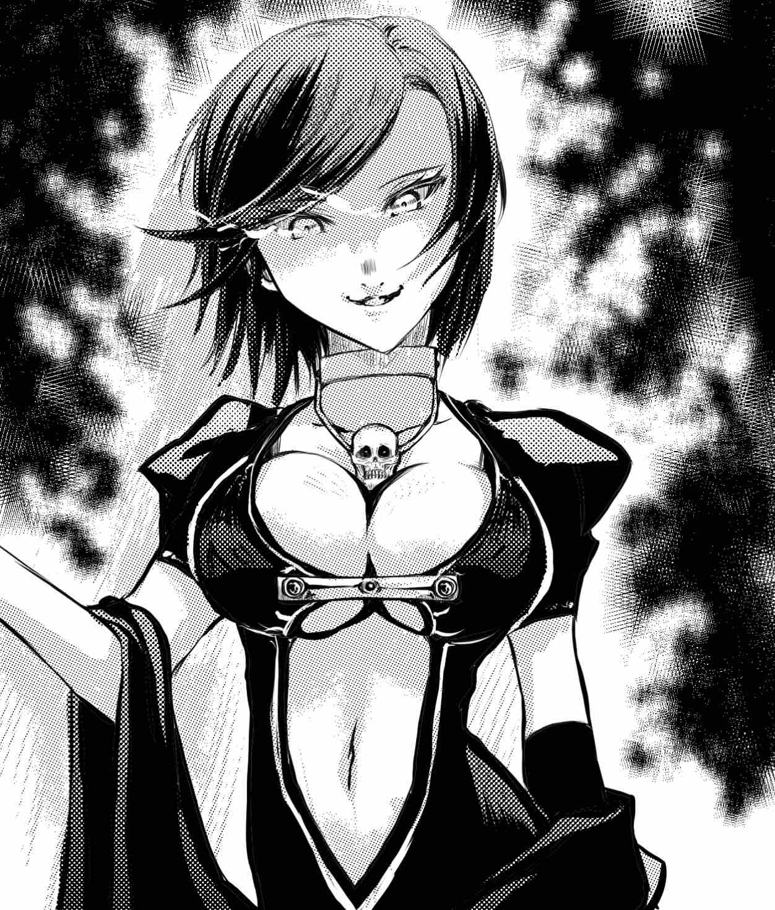

# 非玩家角色

## 克雷孟特．萊特（萊特家主）

凱爾希的老爹，萊特大善人。

## 諾瑪．波頓（女僕長）

家主年少時就跟在身邊的心腹，原先是生在貧苦家庭的孩子，不過遇見家主之後，家主教了她很多東西，也把很多東西交給她打理，生活日漸好過之後，和侍衛長結婚生了孩子，但依然繼續扶持著家主。

## 海蘭．懷特 (仕女)

年紀稍長於凱爾希，是從小被凱爾希的父親收留的孩子，特別崇拜萊特家主，也是凱爾希的貼身仕女，個性很灑脫，做事膽大心細。

## 文森．波頓 (戀人)

凱爾希的青梅竹馬，女僕長的兒子。

被凱爾希吸取生命而死亡之後，他的靈魂來到了莉蓮娜身邊，成為了莉蓮娜忠實的僕人。

## 亡者女王莉蓮娜

精通死靈術的旅法師，她擅長用魔法力來復活死者，腐化生者，並從死亡中召喚力量。外表只有20來歲，實際上她已經經歷過一個世紀的滄桑。

在十年前與凱爾希相遇，當時的凱爾希身受重傷，身為貴族的父親四處尋求名醫但是仍舊無法拯救自己心愛的女兒。最後找上了莉蓮娜，以自身的靈魂與女兒的身體作為了交換，讓愛女的生命可以得以延續。莉蓮娜在凱爾希的身上加上了死亡的詛咒，所有凱爾希所碰觸到的生命都會瞬間凋零，其生命力將會轉換成為凱爾希的生命泉源。

而逝去的靈魂則會來到莉蓮娜的身邊，作為其忠實的僕人而永遠活著。

## 復仇者賈路

旅行於各時空之間的偉大獵人，在與莉蓮娜的交鋒之後受到詛咒，之後一生都在尋找著莉蓮娜的下落。

受到詛咒侵蝕而失去了正常言語的能力，滿腦子只剩下向莉蓮娜復仇的意識。
