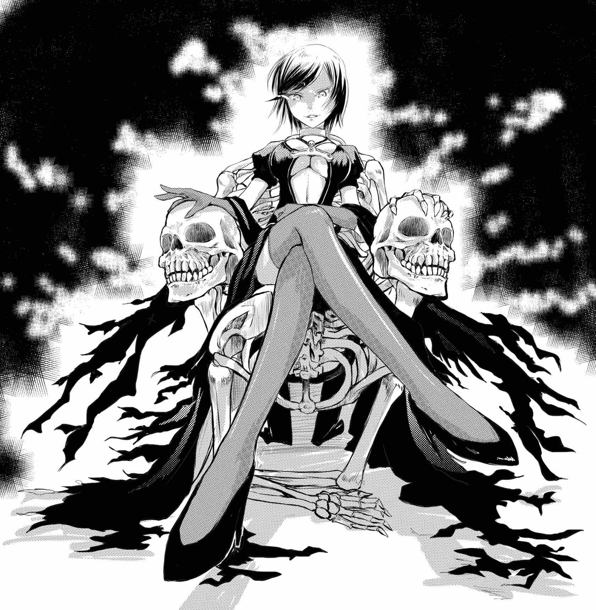

# 故事章節

## 初入小鎮

來到小鎮的凱爾希，為了找尋讓戀人復活的方式而進入了小鎮的夜晚。

- 順著告示牌的訊息，前往小鎮中央的酒吧
  - 了解小鎮夜晚的機制
  - 從酒吧老闆那邊獲得符咒
- 在神社進行了參拜
- 回到酒吧跟其他人打聽了各自在夜晚遇到的情況

## 夜晚到來

踏出酒吧之後彷彿來到了另一個世界，街上毫無人煙，建築也都荒廢已久。

- 再次前往神社進行參拜
  - 奉納箱上出現了一張符咒
  - 繪馬區掉下了一個繪馬，上面一字不差地寫著凱爾希心中的願望
- 離開神社的時候看到了海蘭（仕女）的背影
  - 海蘭聽到了凱爾希的聲音，但是沒有回應，獨自走進了隧道之中

## 湖畔驚魂

在夜晚的小鎮中徘徊的凱爾希，來到了記憶中似曾相似的湖泊。

在湖泊中，凱爾希再次地經歷了戀人死亡的場景，而死亡的戀人彷彿是要復仇般地向凱爾希襲擊過來。

## 復仇者賈路

拿著大斧的獵人解救了陷入危機的凱爾希，同時口中不斷唸著莉蓮娜的名字。

- 獵人抓到凱爾希之後才發現凱爾希並不是自己要找的莉蓮娜
  - 獵人是遭到莉蓮娜的詛咒
  - 凱爾希身上帶有著莉蓮娜的氣息
- 回到剛剛被襲擊的地方，撿到了符咒

## 再次相遇

驚魂未定的凱爾希在離開湖畔的時候，遭到馬車的衝撞，在失去意識之後被救了起來。救了凱爾希的人正是記憶中的戀人，但是文森卻表示自己不認識凱爾希。

在文森的帶領之下，凱爾希來到了文森主人的家中，而此處的建築，跟凱爾希記憶中的萊特宅邸卻是一模一樣的。

## 亡者女王莉蓮娜

凱爾希見到文森現在的主人的時候，回憶起了自己當時受到詛咒的場景，發現自己所擁有的記憶是虛假的。自己所認知的詛咒，其實是讓自己能夠延續生命的重要能力。

凱爾希向莉蓮娜詢問了當年讓自己能夠生存下來的交易內容：

1. 萊特家主將自己靈魂的一半奉獻給莉蓮娜
2. 凱爾希復活，但是必須吸取周圍的生命力才能夠得以生存
3. 修改凱爾希的記憶，讓她忘記這件事情

## 凱爾希的決定

凱爾希得知了自己其實是被復活的生命，開始對自己是否該向亡者女王祈求相同的事情來復活文森感到猶豫。

- 前往地下室
  - 找到裝載文森記憶的容器
  - 把記憶的容器藏到客房
- 詢問文森是否想要恢復記憶
  - 文森表示自己可以接受現在的生活
- 前往書房尋找莉蓮娜

最終，凱爾希決定不讓文森恢復記憶，一個人回到現世。
