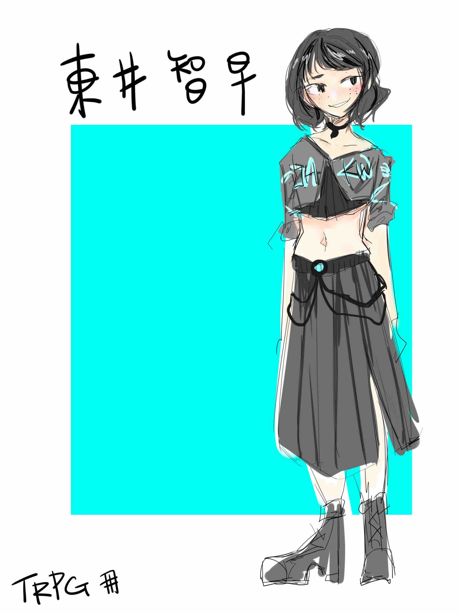

# 東井智早

性別：女

年齡：１７

## 家庭背景

單親。父親從事日本知名電台公司的總經理，而母親自從離婚後再也沒有消息，並沒有太多時間管教女兒，通常就是扔一大筆錢在家後就放任式教育，這也或許是智早性格扭曲的主因。

## 個性

會用錢和暴力解決所有事情。只相信眼前所見的現實型女子，對所有事情抱持著懷疑和不相信，在沒有任何證據的情況下會非常固執，否定幽靈那一類的存在，畢竟她從未見過。

## 暴走族

晚上或是空閒的休閒樂趣就是當個武暴走，儘管現今的暴走族不像以前這麼多，但不怕警察的人還是存在，東井智早就是典型的例子，反正塞點錢給警察就能處理了。

但她也不是因為甚麼愛國情懷而加入暴走族的，反之她一點都不在乎甚麼七生報國，只是覺得暴走族的模樣和車子很帥很有吸引力罷了，更可能想藉由這極具特色的暴走族身分讓她的家人多注意她一點，或許這才是契機也說不定。

## 在爆走族裡的地位

智早非常討厭有人拐彎抹角，無論是說話還是行動都不喜歡，那樣的猶豫會讓她沒有耐心，但撇除這一點就是一個挺好相處的女孩，也有一定的善良存在，所以大家頃向於將事情交給她主導，使得她在爆走族的地位越來越高，雖然智早本人並沒有察覺就是了。

## 校園人際

在家裡附近的高中讀書，因為她並不隱瞞自己的身分，導致在班上的地位有點像是大姊頭之類的存在，同學並不怎麼敢（想？）和她講話，但實際和智井相處過的人都明白她不過就是缺乏安全感所以到處惹事的蠢材而已

## 生活模式

白天上課，晚上幾乎都是去跑車跑山喝酒甚麼鬼的，但因為參與的是較為暴力成分的暴走族，時常發生幹架鬥毆之類的事情，智早並不怕發生這種事，儘管身為女性力氣上卻不怎麼輸人，畢竟平常都是自己把這麼麻煩的車子牽來牽去的，所以在戰鬥力上智早有十足的把握，雖然每次還是弄得滿身傷。
