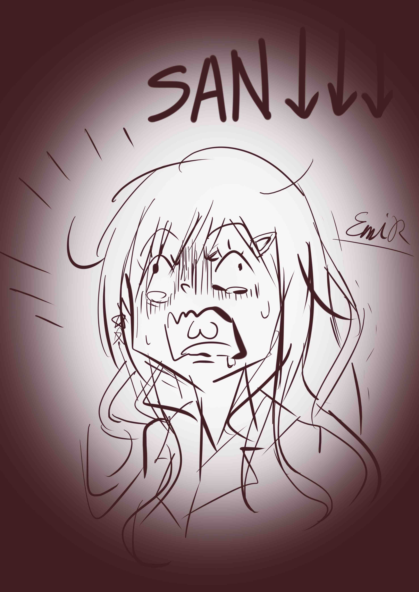

# 故事章節

## 導入 - 東井智早

暴走族們來到經常聚集的地方進行例行性的聚會，過程中遇到了其他勢力的老大（石田）帶著一群黑影來搗亂。

- 石田要求交出集團內的一名少女（千草）
- 與對方一言不合之後開打
- 智早在混戰中被黑影擊中
- 混戰之後，石田悄悄地離開了現場
- 搜片整座山頭之後仍然找不到石田的下落
- 總長決定隔天去石田的大本營

暴走族們來到了石田的大本營廢棄倉庫找石田算帳。

- 石田在前一陣子落敗，下落不明，而殘存的勢力也已經瓦解
- 暴走族找到石田在倉庫裡面的小房間
- 打開小房間之後看到裡面的儀式擺設
- 千草想起自己的爺爺有在弄類似的儀式
- 智早跟千草約定週末前往千草爺爺的家

## 導入 - 東山愛実

愛実在某個熟識的常客下被介紹給了一個居住在山中的有錢人家，但是卻被下藥陷入了昏迷。

## 導入 - 御堂赤彥

在山中進行棄屍的赤彥，遇到了一名執事表示願意高價收購手中的屍塊。跟著執事來到了山中的小屋。

## 山中小屋

赤彥跟著執事來到了山中小屋。來到地下室將手中的屍塊丟入魔法陣之後回到了一樓，正好遇到前來尋找爺爺的千草與智早。

- 智早認出了眼前的執事就是前幾天看到的石田
- 執事前往泡茶，讓一行人在客廳進行交流

## 異變

在地下室醒過來的愛実，發現自己被關在籠子裡面，而眼前正舉行著詭異的儀式，原本應該是屍體的男性復活了過來變成了一名身高超過兩公尺的巨人，離開了地下室。

- 一樓的人們聽到地下室傳來聲音，同時室內突然停電
- 巨人從地下室走到一樓，接著直接前往了二樓深處的房間
- 智早前往地下室，遇到了被關著的愛実

一行人在一樓會合，試圖離開這個地方，打開門之後卻發現外面已經被連結到異樣的空間，其中還有曾經襲擊過智早的黑影存在。執事告訴其他人：要離開這個空間，必須關上異世界的門、或是把巨人打倒。

## 逃離異世界

- 前往地下室
  - 找到魔法陣的相關筆記
  - 發現魔法陣中央的奇妙黑洞
    - 裡面有不知名的生物會對外部進行攻擊
  - 稍微破壞魔法陣
    - 中間的黑洞會隨著魔法陣被破壞而變大
- 回到一樓
  - 獲得了異世界的生物會被地下室的儀式蠟燭吸引
  - 一行人決定把樓上的巨人引導到地下室的黑洞之中
- 前往二樓
  - 愛実取回了自己當時進入山中小屋時所攜帶的物品
  - 利用蠟燭吸引了巨人的注意，一路引誘到地下室
- 前往地下室
  - 破壞魔法陣
  - 愛実利用手上的噴霧跟蠟燭火焰的搭配，避免怪物趁黑洞擴大時衝出
  - 其他人使用蠟燭引誘著巨人前往黑洞旁邊

巨人一路跟著蠟燭的蹤跡來到了地下室，即將踏入黑洞之時發現了躲藏在一旁的赤彥。趁著巨人停下腳步的那瞬間，愛実使出全身的力氣往巨人身上撞過去，成功地把巨人撞入了黑洞裡面。

在一旁全程觀看的執事對一行人的行為讚譽有嘉，並表示自己在脫離了人類的控制之後，也打算回到另一個世界去，主動跳入黑洞之後順手地把黑洞給關上。而此時的山中小屋也恢復了原本的樣子。
